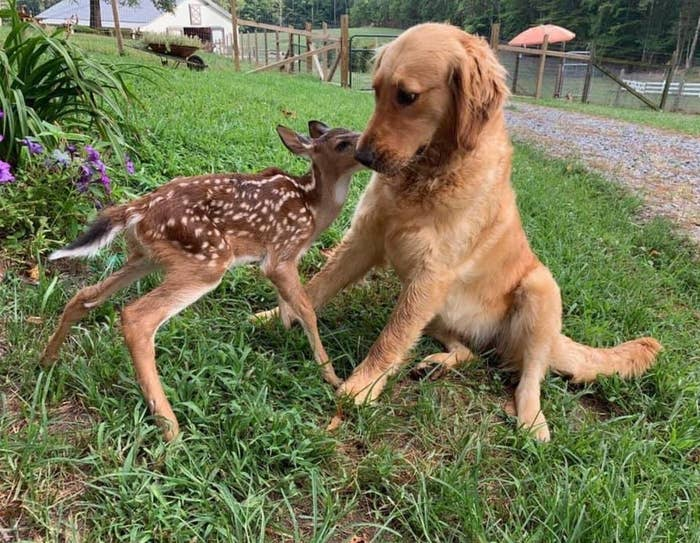

```{r setup, include=FALSE}
options(htmltools.dir.version = FALSE)
knitr::opts_chunk$set(
  fig.width=9, fig.height=3.5, fig.retina=3,
  out.width = "100%",
  cache = FALSE,
  echo = TRUE,
  message = FALSE, 
  warning = FALSE,
  hiline = TRUE
)
```

```{r xaringan-themer, include=FALSE, warning=FALSE}
library(xaringanthemer)
style_mono_light(
  base_color = "#23395b",
  footnote_font_size = "20px",
  footnote_color = "gray",
  text_slide_number_font_size = "18px"
)
```

```{r xaringanExtra, echo=FALSE}
xaringanExtra::use_tachyons()
xaringanExtra::use_clipboard()
```

```{r packages, echo=FALSE, message=FALSE}
library(tidyverse)
library(knitr)
library(kableExtra)
library(countdown)
library(patchwork)
```
class: onecol

<style type="text/css">
.onecol {
    font-size: 26px;
}
.twocol {
  font-size: 24px;
}
.remark-code {
  font-size: 24px;
  border: 1px solid grey;
}
a {
  background-color: lightblue;
}
.remark-inline-code {
  background-color: white;
}
</style>

## Today's Topics

Provide a brief introduction to  What is it, how and when should we do it, and why should we care?

Overview of common preregistration  (e.g., Open Science Framework, AsPredicted), including templates for secondary data analysis.

--

<p style="padding-top:20px;"> Address common  about preregistration (e.g., "what if someone scoops my ideas?").

Provide you with enough knowledge to start !

---
class: inverse, center, middle
# What is Pre-Registration?

---
class: onecol

## Why Pre-Register? 

.pull-left[
Start with a question (and a hypothesis). 

But then, do you...

- Control for demographics? 
- Exclude outliers?
- Use the median or mean? 
- Use the full scale or subscales? 
- Which timepoints? 
- Listwise deletion, pairwise deletion, or imputation?
]

.pull-right[
.center[
```{r, echo = FALSE, out.width = "65%"}
include_graphics("forkingpaths_1.png")
```
]
]

---
class: onecol

## Why Pre-Register? 

.pull-left[
Start with a question (and a hypothesis). 

But then, do you...

- Control for demographics? 
- Exclude outliers?
- Use the median or mean? 
- Use the full scale or subscales? 
- Which timepoints? 
- Listwise deletion, pairwise deletion, or imputation?
]

.pull-right[
.center[
```{r, echo = FALSE, out.width = "65%"}
include_graphics("forkingpaths_2.png")
```
]
]

---
## Questionable research practices are common

.center[
```{r, echo = FALSE, out.width = "80%"}

```
]

---
class: twocol

## Pre-Registration Basics

.left-column[
```{r, echo = FALSE}

```

]
.right-column[
Pre-registrations are  typically created **before** starting data collection<sup>1</sup>. 

The goal is to make a clear distinction between *exploratory* and *confirmatory* work. 

There are many templates available on the [Open Science Framework](https://osf.io/zab38/wiki/home/); they vary in specificity/length but typically include: 
- Study information
- Specific hypotheses
- Methods 
- Specific analysis plan
- Whether data collection has begun
]

.footnote[
[1] However, there are preregistration templates available for secondary data collection. <br>
]
---
class: inverse, center, middle

# Common Pre-Registration Templates

---
class: onecol

## Standard OSF Registration

Standard, comprehensive, general purpose preregistration form ([template](https://osf.io/jea94/) | [tutorial](https://help.osf.io/hc/en-us/articles/360019738834-Create-a-Preregistration))

Preregister:
- Study information (title, authors, brief description, hypotheses<sup>1</sup>)
- Design plan (study type, blinding, study design, randomization)
- Sampling plan (existing data, data collection procedures, sample size)
- Variables (manipulated variables, measured variables, indices<sup>2</sup>)
- Analysis plan (statistical models<sup>1</sup>, transformations, inference criteria, data exclusion, missing data, exploratory analysis)

.footnote[
[1] Hypotheses should be specific, concise, and testable. <br>
[2] Precisely specify if and how measurements will be combined into an index (e.g., sum score, subscales) <br>
[3] As described on the template, this is perhaps the most important and complicated question. It is crucial to provide a specific recipe for analyzing the data, and avoid leaving any uncertainties/open questions.
]

---
class: onecol

## AsPredicted Registration

Shorter general-purpose preregistration ([template](https://docs.google.com/document/d/13FFwD_UNUyA4O0iOGyy66_EViN1LkkM4QT_iiUiOwEE/edit) | [website](https://aspredicted.org/))

Answer eight questions: 
1. Have any data been collected for this study already? 
2. What's the main question being asked or hypothesis being tested in this study? 
3. Describe the key dependent variable(s) specifying how they will be measured. 
4. How many and which conditions will participants be assigned to? 
5. Specify exactly which analyses you will conduct to examine the main question/hypothesis.
6. Any secondary analyses? 
7. How many observations will be collected or what will determine the sample size?
8. Anything else you would like to preregister? 

---
class: onecol

## Secondary Data Registration 

For preregistering research using an existing dataset ([FAQ](https://docs.google.com/document/d/1uJR2D4rLbGXLG1lESRjX9cQ12LVl2APoK2rJj4OGaRU/edit#) | [Template](https://osf.io/v4z3x/) | [Paper](https://osf.io/6t72r/)).

This template includes many of the same questions as prior templates (e.g., clear description of measures, statistical analysis plans, etc.), with some important additions specific to working with existing data: 

- Data description (datasets used, data availability, data access date)
- Knowledge of data<sup>1</sup>: 
  - Prior publications/presentations you have worked on from the dataset 
  - Prior knowledge that may be relevant for proposed analyses (e.g., from working with the data firsthand, reading previously published research, codebooks)
  - Transparently report any direct or indirect knowledge about hypothesized associations of your variables. 

.footnote[
[1] Describe prior knowledge of data for each co-author separately 
]

---
class: inverse, center, middle 

# Common Questions and Concerns 

---
class: onecol

## Pre-registration sounds great, but... 

- "What if someone scoops me"? 
  - Time stamps verify your claims
  - pre-registrations can be embargoed


--

- "Does this mean I can't look at anything else in my data?"
  - No! You can still explore your data; pre-registrations help differentiate *confirmatory* vs. *exploratory* research.


--

- "What if I find a better way to analyze my data?"
  - That's great! You can indicate this in your paper and explain any deviations from pre-registration protocols.


--

- "Can't people cheat?" 
  - Yes. Pre-registrations can be "hacked" - but this makes questionable research practices more intentional. 
  - Pre-registrations help you stay accountable to yourself. 

---
class: twocol
## Thank you! 

.pull-left[
Shirley Wang <br />
PhD Candidate, Harvard University <br />
Clinical Psychology <br />
Computational Science & Engineering

Email: [shirleywang@g.harvard.edu](mailto:shirleywang@g.harvard.edu)<br/><br>
Twitter: [@ShirleyBWang](https://twitter.com/ShirleyBWang)<br /><br>
Website: [shirleywang.rbind.io](https://shirleywang.rbind.io/)<br />
]

.pull-right[
```{r, echo = FALSE, out.width = "70%"}

```
]

.footnote[
All materials available on [github](https://github.com/ShirleyBWang/osworkshop_edrs2021). For more, see https://osf.io/pbv27/. 
]