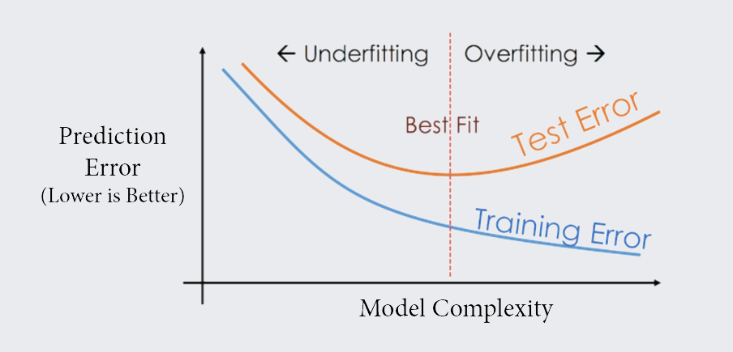
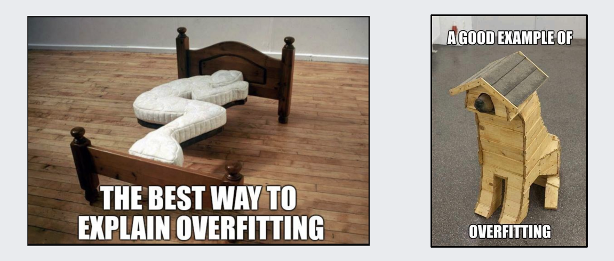
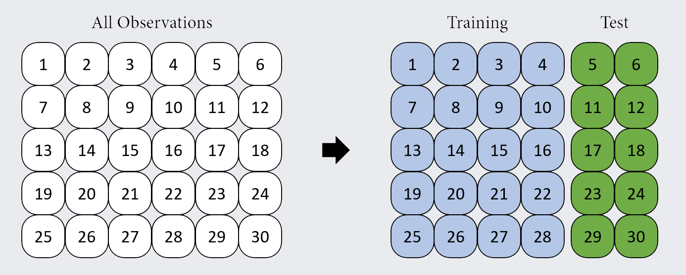
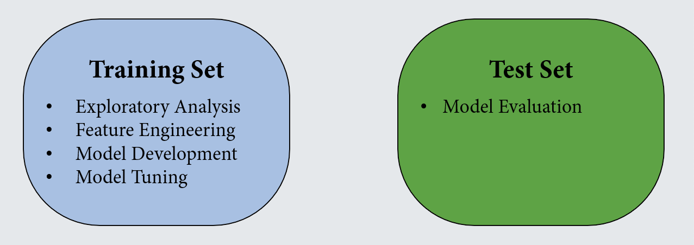
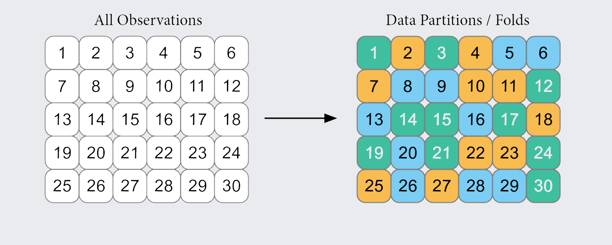
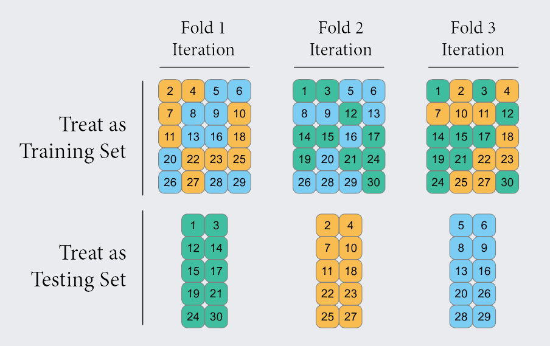
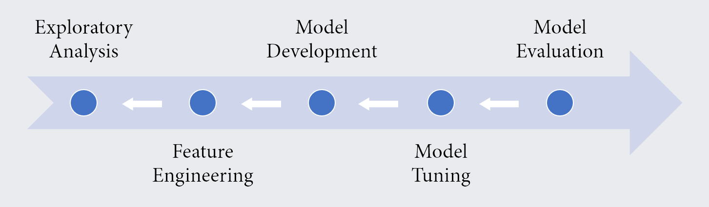
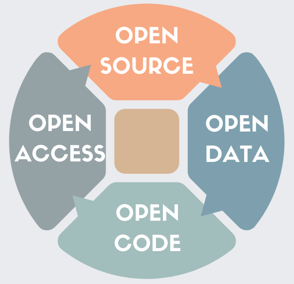

```{r setup, include=FALSE}
options(htmltools.dir.version = FALSE)
knitr::opts_chunk$set(
  fig.width=9, fig.height=3.5, fig.retina=3,
  out.width = "100%",
  cache = FALSE,
  echo = TRUE,
  message = FALSE, 
  warning = FALSE,
  hiline = TRUE
)
```

```{r xaringan-themer, include=FALSE, warning=FALSE}
library(xaringanthemer)
style_mono_light(
  base_color = "#23395b",
  footnote_font_size = "20px",
  footnote_color = "gray",
  text_slide_number_font_size = "18px"
)
```

```{r xaringanExtra, echo=FALSE}
xaringanExtra::use_tachyons()
xaringanExtra::use_clipboard()
```

```{r packages, echo=FALSE, message=FALSE}
library(tidyverse)
library(knitr)
library(kableExtra)
library(countdown)
library(patchwork)
```
class: onecol

<style type="text/css">
.onecol {
    font-size: 26px;
}
.twocol {
  font-size: 24px;
}
.remark-code {
  font-size: 24px;
  border: 1px solid grey;
}
a {
  background-color: lightblue;
}
.remark-inline-code {
  background-color: white;
}
</style>

## Today's Topics

Provide a  to predictive modeling/machine learning.

Introduce common **terms** in machine learning.

Understand similarities and differences between **inference** and **prediction**. 

Describe methods for increasing  of machine learning approaches for big data.

Discuss methods for incorporating **open science** into the machine learning workflow.

.footnote[Slides adapted from the Pittsburgh Summer Methodology Series [Applied Machine Learning in R](https://pittmethods.github.io/appliedml/) course, developed by Jeffrey Girard and Shirley Wang.]

---
class: inverse, center, middle
# Conceptual Introduction
---
class: onecol
## What is machine learning?

The field of machine learning (ML) is a **branch of computer science**.

ML researchers **develop algorithms** with the capacity to .

When algorithms learn from (i.e., are **trained on**) data, they create **models**.<sup>1</sup>

--

<p style="padding-top:20px;">ML algorithms are often used to create .</p>

The goal will be to **predict unknown values** of important variables **in new data**

Note that this differs from traditional inferrential statistics<sup>2</sup>, which aims to **understand** and **explain** phenomena rather than **predict** it.  

.footnote[
[1] ML models are commonly used for prediction, data mining, and data generation. <br>
[2] For an excellent overview of explanation vs. prediction in psychology, I recommend [Yarkoni & Westfall (2017)](https://journals.sagepub.com/doi/abs/10.1177/1745691617693393).
]

---
class: inverse, center, middle
# Signal and Noise
---
class: onecol

## A Delicate Balance

Any data we collect will contain a mixture of **signal** and **noise**

- The "signal" represents informative patterns that generalize to new data
- The "noise" represents distracting patterns specific to the original data

We want to capture as much signal and as little noise as possible

--

<p style="padding-top:30px;">More complex models will allow us to capture <b>more signal</b> but also <b>more noise</b></p>

: If our model is too complex, we will capture unwanted noise

: If our model is too simple, we will miss important signal

---

## Model Complexity
```{r complexity, echo=FALSE, fig.showtext = TRUE}
set.seed(2021)
signal <- function(x) {sin(2*pi*x)}
x_linspace <- seq(0, 1, by = 0.02)
x_data <- runif(length(x_linspace), 0, 1)
y_true <- signal(x_linspace)
y_data <- signal(x_data) + rnorm(length(x_data), 0, 0.25)
dat <- tibble(
  x_linspace,
  x_data,
  y_true,
  y_data
)

p1 <- 
  ggplot(dat) + 
  geom_point(aes(x = x_data, y = y_data), shape = 1, size = 3, color = "grey30") + 
  stat_smooth(
    aes(x = x_data, y = y_data), 
    method = "lm", 
    se = FALSE,
    formula = y ~ x, 
    color = "blue",
    size = 1.5
  ) +
  coord_cartesian(xlim = c(0, 1)) +
  labs(title = "Underfitting", x = "feature", y = "label") +
  theme_xaringan(text_font_size = 14, title_font_size = 18) +
  theme(panel.grid.minor = element_blank(),
        panel.background = element_rect(fill = "white"))

p2 <- 
  ggplot(dat) + 
  geom_point(aes(x = x_data, y = y_data), shape = 1, size = 3, color = "grey30") + 
  stat_smooth(
    aes(x = x_data, y = y_data), 
    method = "lm",
    se = FALSE,
    formula = y ~ poly(x, 4), 
    color = "purple",
    size = 1.5
  ) +
  coord_cartesian(xlim = c(0, 1)) +
  labs(title = "Good Fit", x = "feature", y = NULL) +
  theme_xaringan(text_font_size = 14, title_font_size = 18) +
  theme(panel.grid.minor = element_blank(),
        panel.background = element_rect(fill = "white"))

p3 <- 
  ggplot(dat) + 
  geom_point(aes(x = x_data, y = y_data), shape = 1, size = 3, color = "grey30") + 
  stat_smooth(
    aes(x = x_data, y = y_data), 
    method = "lm",
    se = FALSE,
    formula = y ~ poly(x, 17), 
    color = "red",
    size = 1.5
  ) +
  coord_cartesian(xlim = c(0, 1)) +
  labs(title = "Overfitting", x = "feature", y = NULL) +
  theme_xaringan(text_font_size = 14, title_font_size = 18) +
  theme(panel.grid.minor = element_blank(),
        panel.background = element_rect(fill = "white"))

(p1 | p2 | p3) + 
  plot_annotation(
    theme = theme(
      plot.background = element_rect(fill = "#E9EBEE", color = NA)
    )
  )
```

---
class: twocol
## A Super Metaphor
.pull-left[
What makes machine learning so amazing is its **ability to learn complex patterns**.

However, with this great power and flexibility comes the looming **danger of overfitting**. 

Overfitting reduces **generalizability** and **reproducibility**. Thus, much ML research aims to detect and counteract overfitting.

For detection, we need two sets of data:

: used to learn relationships

: used to evaluate performance
]

.pull-right[
.center[
```{r kryptonite, echo=FALSE, out.width="67%"}

```
]
]

---
## A Graphical Explanation of Overfitting
```{r overgraph, echo=FALSE}

```

---
## A Meme-based Explanation of Overfitting
```{r overmeme, echo=FALSE}

```

---
class: inverse, center, middle
# Countering Overfitting
---
class: onecol
## Cross-Validation
There are some clever algorithmic tricks to prevent overfitting

- For example, we can penalize the model for adding complexity

The main approach, however, is to use :

--

- Multiple **fully independent** sets of data are created (by subsetting or resampling)

- Some sets are used for training (and tuning) and other sets are used for testing

- **Model evaluation is always done on data that were not used to train the model**

- This way, if performance looks good, we can worry less about variance/overfitting

--

.bg-light-yellow.b--light-red.ba.bw1.br3.pl4[
**Caution:** We still need to consider whether the original data was representative!
]

---
# Holdout Cross-Validation
```{r, echo=FALSE}

```

---
# Holdout Cross-Validation
```{r, echo=FALSE}

```

---
# k-fold Cross-Validation
```{r, echo=FALSE}

```

---
count: false
# k-fold Cross-Validation
.center[
```{r, echo=FALSE, out.width="70%"}

```
]

---
class: inverse, center, middle
# Modeling Workflow
---
## Typical ML Workflow

<br /><br />

.center[
```{r workflow, echo=FALSE}

```
]
---
class: twocol
## Incorporating Open Science into the ML Workflow

.pull-left[
<br>
The development and evaluation of machine learning models should be **open**, **transparent**, and **reproducible**.

**Preregistration** of some methods (e.g., cross-validation procedure, model evaluation metrics, specific algorithms) can be useful.

Be transparent about **model limitations**, including limits to generalizability. 

Consider potential for **harm**. Does the model combat or entrench societal injustices?
]

.pull-right[
```{r, echo = FALSE}

```
]

---
class: twocol
## Thank you! 

.pull-left[
Shirley Wang <br />
PhD Candidate, Harvard University <br />
Clinical Psychology <br />
Computational Science & Engineering

Email: [shirleywang@g.harvard.edu](mailto:shirleywang@g.harvard.edu)<br/><br>
Twitter: [@ShirleyBWang](https://twitter.com/ShirleyBWang)<br /><br>
Website: [shirleywang.rbind.io](https://shirleywang.rbind.io/)<br />
]

.pull-right[
```{r, echo = FALSE, out.width = "65%"}

```
]

.footnote[
All materials available on [github](https://github.com/ShirleyBWang/osworkshop_edrs2021). For more, see https://pittmethods.github.io/appliedml/. 
]